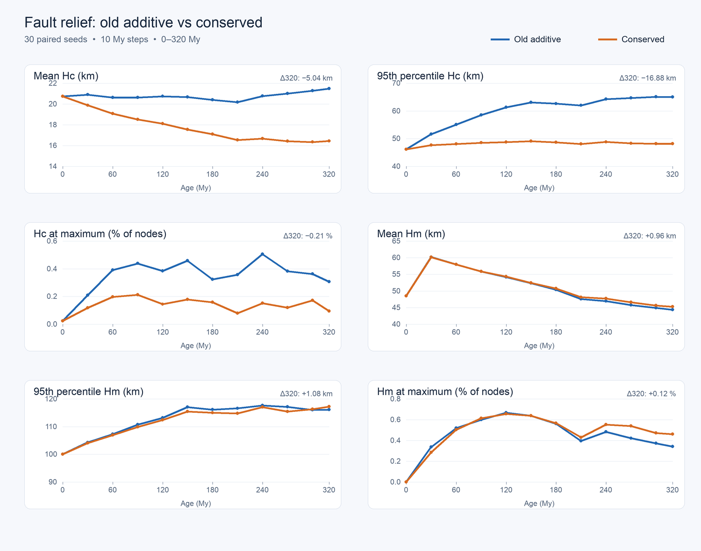

# Fault relief Hc/Hm comparison (issue #213)

The [paired sweep](../bin/debug/compare_fault_relief.py) starts 30 fresh worlds with the
same seed under two fault-relief implementations. `old_additive` reproduces the
pre-#213 pass, including its Hc-backed but unbalanced elevation increments.
`conserved` uses the local transfer pass in this change. Both use node density 1,
10 My steps, and measurements at 0, 30, 60, 90, 120, 150, 180, 210, 240, 270,
300, and 320 My. All 720 seed/implementation/checkpoint records completed.

| Metric at 320 My | Old additive | Conserved | Paired change (new − old) |
| --- | ---: | ---: | ---: |
| Mean Hc | 21.48 km | 16.44 km | −5.04 ± 0.33 km |
| 95th-percentile Hc | 65.03 km | 48.15 km | −16.88 ± 1.47 km |
| Nodes with Hc at cap | 0.31% | 0.09% | −0.21 percentage points |
| Mean Hm | 44.33 km | 45.29 km | +0.96 ± 0.46 km |
| 95th-percentile Hm | 116.14 km | 117.22 km | +1.08 ± 2.96 km |

The uncertainty after `±` is the standard error of the 30 paired seed
differences. Hc separates early and remains substantially lower in the
conserved runs. The fault pass does not directly edit Hm; later Hm differences
arise through the world's coupled evolution. This sweep measures the long-run
effect of changing the fault rule, not conservation by every other tectonic or
magmatic process. Its 10 My steps also differ from the 100 kyr checkpoint
continuation in the issue's initial report.

The [summary](data/issue-213-hc-hm-summary.json) has every checkpoint's paired
mean and standard error. The [raw records](data/issue-213-hc-hm-raw.jsonl) allow
the aggregates to be recomputed. Run the sweep with
`backend/.venv/bin/python bin/debug/compare_fault_relief.py --workers 4`; the
output is resumable. The [plot script](../bin/debug/plot_fault_relief.py) renders
the chart with Pillow.
